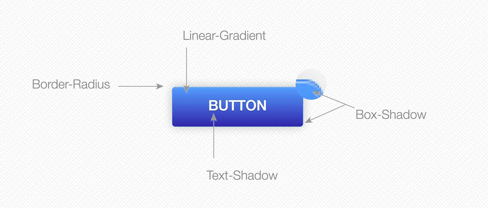

With a few simple changes to how we handle our web graphics we can prepare for the retina web.

Retina screen usage surges. New devices have progressively high density displays.

There’s an ever growing body of javascript helper libraries [link](http://www.smashingmagazine.com/2014/05/12/picturefill-2-0-responsive-images-and-the-perfect-polyfill/ "picturefill-2-0: Responsive Images and the perfect polyfill"), techniques [link](http://www.smashingmagazine.com/2013/06/02/clown-car-technique-solving-for-adaptive-images-in-responsive-web-design/ "Clown Car Technique") [link](http://ericportis.com/posts/2014/srcset-sizes/ "Srcset Sizes"), and opinions [link](http://davidwalsh.name/responsive-images "Responsive Images") [link](http://www.slideshare.net/teleject/convergese-adaptiveimagesconverge-se "Convergese Adaptive Images") [link](http://alistapart.com/article/responsive-images-how-they-almost-worked-and-what-we-need "Responsive Images: How they almost worked and what we need") [link](http://css-tricks.com/which-responsive-images-solution-should-you-use/ "Which Responsive Image Solution You Should Use") about how to what this means for our website and how to adapt our graphical assets.

This situation reminds me of a similar one concerning CSS and grids, to which Chris Coyier responded [Don’t Overthink It Grids](http://css-tricks.com/dont-overthink-it-grids/ "Don't Overthink it Grids").

We want _the highest quality images_ with _the lightest possible effect on page weight_ and _the easiest possible implementation_. My basic strategy:

1.  Think retina first
2.  Pick the right tool for the job
3.  Test & Adjust Accordingly

There are some exceptions to what I’m about to say, but this will honestly get you past 90% of the way to being retina-ready.

## Think Retina First

> Always target high-density displays by default, don’t make it an afterthought —Thomas Fuchs

### Use CSS First!

Grizzled web veterans will recall spacer GIFS, rounding corners with images, and other archaic pixel-laden techniques used to drive web 2.0\. Thankfully, many of these we can now accomplish with CSS.

CSS is fast to load, well-supported, scaleable, (often) dynamic, and 99.9% retina ready.

#### Some Useful CSS Techniques

*   [39 Ridiculous Things To Do With CSS3 Box Shadows](http://viget.com/inspire/39-ridiculous-things-to-do-with-css3-box-shadows)
*   [The Humble Border Radius](http://lea.verou.me/humble-border-radius/#intro)
*   [CSS Drop Shadows Without Images](http://nicolasgallagher.com/css-drop-shadows-without-images/demo/)
*   [Export CSS from Sketch](http://bohemiancoding.com/sketch/support/documentation/11-exporting/5-css.html)
*   [Export CSS from Photoshop (if you are a photoshopper)](http://blogs.adobe.com/jnack/2012/12/demo-new-css-export-from-photoshop-cs6.html)
*   [CSS3 Gradients, from #fff to #000…](http://lea.verou.me/css3-gradients/#intro)

### Use Vector Second

Vector based formats (like SVG, Fonts, and Icon Fonts) are resilient. They are composed of resolution independent mathematical formulas; so no matter how big they are blown up they will stay crisp.

Vectors are fairly fast to load (although potentially costing your some HTTP requests), scaleable, (potentially) dynamic, and 99.9% retina ready.

  
http://upload.wikimedia.org/wikipedia/commons/9/92/Three_logos.svg

#### Useful Resources for Vectors on the Web

*   [Using SVG](http://css-tricks.com/using-svg/)
*   [SVG Workflow for Designers](http://danielmall.com/articles/svg-workflow-for-designers/)
*   [SVG Icons FTW](http://tympanus.net/codrops/2013/11/27/svg-icons-ftw/)
*   [Resolution Independence with SVG](http://www.smashingmagazine.com/2012/01/16/resolution-independence-with-svg/)
*   [Grunticons: Easiest way to make/manage svg icons](http://www.filamentgroup.com/lab/grunticon.html)
*   [Font Awesome: A quick, free, and awesome icon font](http://fortawesome.github.io/Font-Awesome/)
*   [HTML for Icon Font Usage](http://css-tricks.com/html-for-icon-font-usage/)

### Raster, Last Choice.

Raster images will always be limited by their original pixel canvas. At some point, they will unavoidably be blurry. But if you want that beautiful landscape, you will not want to build it out of CSS Box Shadows. (Although [someone probably could](http://codepen.io/tag/box-shadow/)).

Raster images are dangerous. There are horror stories. Page weights can multiply by orders of magnitude. Images can start to look like garbage on nice screens.

#### The **easy**trick to using JPG, PNG, and GIF

Instead of starting with some complicated technique to serve multiple images consider doing this:

1.  Make your image 2 to 3 times larger than it needs to be.
2.  Export it at _very low_ quality.
3.  Scale down in CSS

This is easy to implement. The pictures will look good on retina screens. Non retina screens just scale it down and look fine. And **it doesn’t increase the file size a ton**.

We’re talking, maybe a 20% increase.

##### Here are some additional resources about this technique:

*   [Retina Revolution](http://www.netvlies.nl/blog/design-interactie/retina-revolution)
*   [Retina Revolutie Follow Up](http://www.netvlies.nl/blog/design-interactie/retina-revolutie-follow-up)
*   [Do retina images really mean larger files?](http://alidark.com/responsive-retina-image-mobile/)
*   [Compressive Images](http://www.filamentgroup.com/lab/compressive-images.html)

## Picking the right tool

Actual success depends mainly on using the right tool for the job. Sometimes you need to use a JPEG. You shouldn’t attempt to recreate a stunning landscape using CSS box shadows! Here’s a run-down:

<table>

<thead>

<tr>

<th>Problem</th>

<th>Solution</th>

<th>Retina-Ready</th>

</tr>

</thead>

<tbody>

<tr>

<td>Text</td>

<td>Use Text</td>

<td>You’re good.</td>

</tr>

<tr>

<td>Complex Pictures</td>

<td>Usually JPEG</td>

<td>Create a 2x version with lower quality.  
Use this version only.  
[More details.](http://stackoverflow.com/questions/2336522/png-vs-gif-vs-jpeg-when-best-to-use)</td>

</tr>

<tr>

<td>Pictures  
with few colors  
or needing transparency</td>

<td>Usually PNG</td>

<td>Create a 2x version with lower quality.  
Use this version only.  
[More details.](http://stackoverflow.com/questions/2336522/png-vs-gif-vs-jpeg-when-best-to-use)</td>

</tr>

<tr>

<td>Animated GIF</td>

<td>Animated GIF</td>

<td>Create a 2x version with lower quality.  
Use this version only.</td>

</tr>

<tr>

<td>Icons, Logos, UI</td>

<td>Usually SVG</td>

<td>Retina Ready.</td>

</tr>

<tr>

<td>UI, Fast</td>

<td>Icon Fonts</td>

<td>Retina Ready.  
Not as flexible as SVG,  
but can’t beat the up-and-running  
time of something like [Font Awesome](http://fortawesome.github.io/Font-Awesome/)</td>

</tr>

</tbody>

</table>

Based off a table in Thomas Fuch’s [Retinafy](http://retinafy.me/). Buy it now. Worth every penny. Full of other gems like [How to Retinafy Your Website](http://mir.aculo.us/2012/06/26/flowchart-how-to-retinafy-your-website/)

### Optimize Whatever You Can

Part of using the right tool is using it right. Optimize everything. It’s easy money.

Run [ImageOptim](https://imageoptim.com/) on JPGEs, GIFs, PNGs, and more.

On SVGs, run [SVGO](https://github.com/svg/svgo)

On PNGs you can optimize to 11 with [ImageAlpha](http://pngmini.com/).

## Test and Adjust Accordingly

There are exceptions to every rule. Make sure to test your images everywhere and see how they look (PSA: Test with y-slow too). Some of the biggest things you could run into:

### Art Direction

If making an image smaller reduces the message it communicates, you might have to swap with a cropped or art-directed image; using something like the <picture> tag to easily switch images based on screen size. [(see number 6)](http://blog.cloudfour.com/8-guidelines-and-1-rule-for-responsive-images/)

### Older Browsers

Like, SVGs don’t work out of the box on old browser. Define your browser support and prepare fallbacks where appropriate.

### Unacceptable Loss of Quality

In most cases using the low quality JPEG trick works great. Sometimes it doesn’t though.

Maybe there are some times when a picture just needs to be weighty, or have different versions based on resolution.

### Slow Networks

It is possible to throw network speed into the mix and serve up low/mid/high res graphic based on what kind of network connection you have.  Doing this you will have to rely on [an alternate solution](http://www.smashingmagazine.com/2013/07/08/choosing-a-responsive-image-solution/).

Now go forth and retinafy!  

